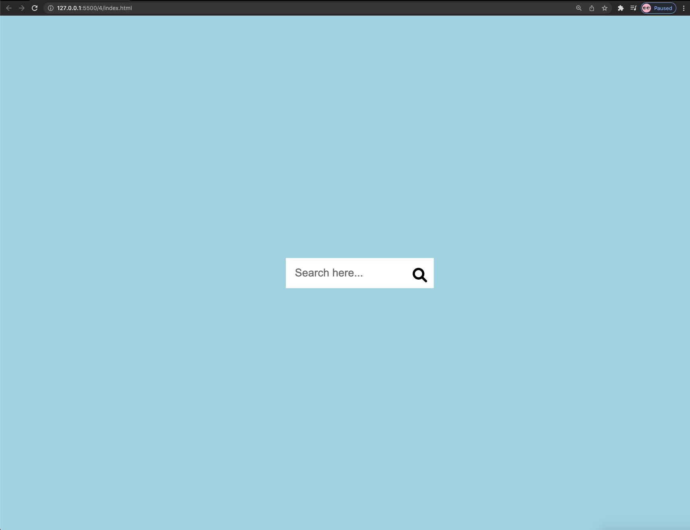

# 50 Day Frontend Practice

> <h3> Goals: </h3>

- Sharpen basic frontend skills
- No framework used in those projects
- Each one should be simple and fast
   
   

> <h3> Project contents:</h3>

|               Name                |                                      Description                                       |
| :-------------------------------: | :------------------------------------------------------------------------------------: |
|      [Expending Cards](#p1)       |                  'click' will invoke the expension of target picture                   |
| [Interactive Progress Steps](#p2) |    visualize progress by the color of the bar; and "Congrats" when you hit the end;    |
|         [Rotate Nav](#p3)         |               Click button will rotate the page and show the nav links;                |
|    [Hidden Search Widget](#p4)    | Click the search icon will expand the search input area, Click again it will disappear |

 
 

>  <h3> Detailed Demo</h3>

<ol>
  <li><h4 id='p1'>Expending Cards ( Dec 6, 2021 )</h4>
    <ul>
      <li>Flexbox in css; </li>
      <li>Change elements' classList in JS</li>
    </ul>
  </li>
  

  <table>
          <tr>
            <td valign="top"></td>
            <td valign="top"></td>
          </tr>
        </table>
  

  <li><h4 id='p2'>Process Steps ( Dec 7, 2021 )</h4>
    <ul>
      <li>postion: relate/absolute;</li>
      <li>element::before; </li>
      <li>custom properties (--line-border-fill)</li>
      <li>btn:hover/active/disabled</li>
      <li>modify elements' style/class in JS</li>
    </ul>
  </li>
  

  <table>
          <tr>
            <td valign="top"></td>
            <td valign="top"></td>
            <td valign="top"></td>
          </tr>
        </table>
  

  <li><h4 id='p3'>Rotate Nav ( Dec 8, 2021 )</h4>
    <ul>
      <li>Transform: rotate(-70deg) </li>
      <li>postion: fixed/absolute</li>
      <li>different color to demenstrate different pages</li>
    </ul>
  </li>
  

  <table>
          <tr>
            <td valign="top"></td>
            <td valign="top"></td>
          </tr>
        </table>
  

  <li><h4 id='p4'>Hidden Search Widget ( Dec 9, 2021 )</h4>
    <ul>
      <li>Transform: translateX(198px) </li>
      <li>postion: relative/absolute</li>
      <li>add 'active' to classList</li>
      <li>Different css to active and non-active html</li>
    </ul>
  </li>
  

  <table>
          <tr>
            <td valign="top"></td>
            <td valign="top"></td>
          </tr>
        </table>
  

</ol>
